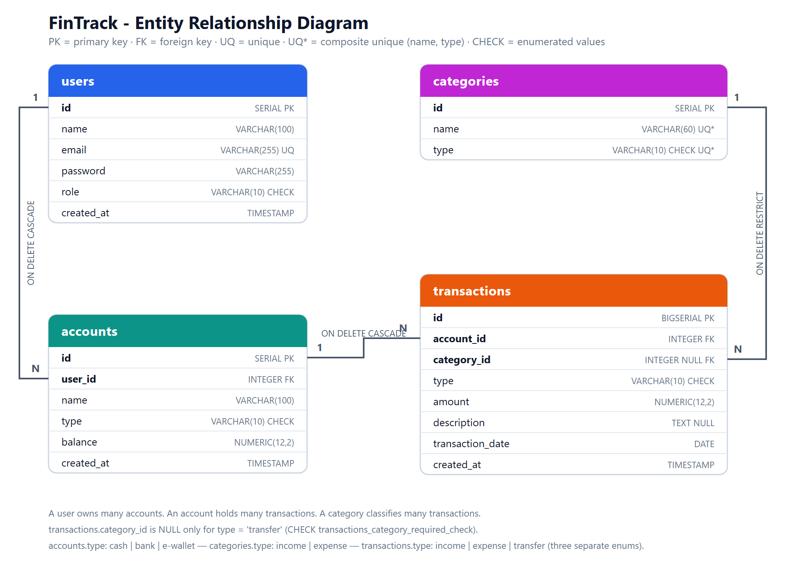

# FinTrack API

A backend for a personal finance tracker, built with **NestJS**, **Prisma** and
**PostgreSQL**. You connect the places your money sits, record what moves in and
out, and tag each movement so you can see where it actually goes.

- **Live URL:** _not yet deployed — see [Deployment](#deployment)_
- **API docs:** [`docs/api-smoke-test.md`](docs/api-smoke-test.md) · Postman: [`docs/fintrack.postman_collection.json`](docs/fintrack.postman_collection.json)
- **ERD:** [`docs/erd.png`](docs/erd.png)

---

## Contents

- [The domain](#the-domain)
- [Data model](#data-model)
- [Quick start](#quick-start)
- [Environment variables](#environment-variables)
- [API reference](#api-reference)
- [Architecture](#architecture)
- [Business logic: the balance rule](#business-logic-the-balance-rule)
- [Authentication, ownership and RBAC](#authentication-ownership-and-rbac)
- [Security hardening](#security-hardening)
- [Database work](#database-work)
- [Testing](#testing)
- [Deployment](#deployment)
- [Project structure](#project-structure)
- [Known limitations](#known-limitations)

---

## The domain

Four concepts, and the rules that connect them:

**A user** signs up with an email and a password. They can be an ordinary
`user` or an `admin`.

**An account** is a place money physically sits: `cash` in a wallet, a `bank`
account, or an `e-wallet` like GoPay or OVO. An account belongs to exactly one
user, and it carries a **balance** — how much is in it right now.

**A category** is a label for a kind of money movement — Salary, Groceries,
Transport. Categories are `income` or `expense`, and they are **shared across
all users**, so everyone's reports use the same vocabulary. Only an admin can
change the list.

**A transaction** is one movement of money: 640 000 rupiah of Groceries paid
out of BCA Payroll on 1 August. It always names the account it hit, it is tagged
with a category, and it is `income`, `expense` or `transfer`.

The rule that makes the whole thing work:

> **`accounts.balance` always equals the sum of that account's transactions.**
> Income adds, expense subtracts. Nothing else may move a balance — you cannot
> set one directly, and a new account always starts at `0.00`.

Two details worth pointing at, because they are easy to get wrong:

- **`amount` is always positive.** Direction lives in `type`, not in the sign.
  A 50 000 expense is stored as `50000.00`, not `-50000.00`.
- **`categories.type` and `transactions.type` are different enums.** A category
  is only ever `income` or `expense`; a transaction can also be a `transfer`.
  A transfer is not a kind of spending, so it carries no category at all — the
  database enforces that with a CHECK constraint.

---

## Data model



The diagram is generated from [`docs/erd.dbml`](docs/erd.dbml), which you can
paste into [dbdiagram.io](https://dbdiagram.io) to edit. A vector version is at
[`docs/erd.svg`](docs/erd.svg).

The same model is written down three times, and all three agree column for
column:

| File | Purpose |
| --- | --- |
| [`db/schema.sql`](db/schema.sql) | Hand-written PostgreSQL DDL |
| [`prisma/schema.prisma`](prisma/schema.prisma) | The ORM model the application uses |
| [`prisma/migrations/20260721010000_init/migration.sql`](prisma/migrations/20260721010000_init/migration.sql) | What `prisma migrate deploy` actually applies |

Nothing is renamed on the way in. Prisma model fields are `snake_case` exactly
like the SQL columns, so a JSON response has the same shape as a row you would
`SELECT` by hand.

**Type choices, and why:**

- `NUMERIC(12,2)` for money, never `FLOAT`. Binary floating point cannot
  represent `0.1` exactly, and those errors accumulate over a ledger.
- `DATE` for `transaction_date` — the day money moved, with no time and no
  timezone — and `TIMESTAMP` for `created_at`, which is a real instant.
- `BIGSERIAL` for `transactions.id`. It is the only table that grows without
  bound.
- CHECK constraints on all three type columns rather than native PostgreSQL
  `ENUM` types, so `'e-wallet'` can keep its hyphen and the API returns exactly
  the value stored.

**Referential actions** are deliberate: deleting a user cascades to their
accounts and transactions, but `transactions_category_id_fkey` is
`ON DELETE RESTRICT` — a category that history still points at cannot be deleted
out from under it (the API turns that into a `409`).

---

## Quick start

**Prerequisites:** Node.js 20+, and PostgreSQL 14+ either locally or hosted
(Supabase, Neon and Railway all have a usable free tier).

```bash
git clone <this-repo>
cd fintrack-api
npm install                 # postinstall runs `prisma generate`

cp .env.example .env
```

Then edit `.env` — at minimum `DATABASE_URL` and `JWT_SECRET`:

```bash
# generate a real secret
node -e "console.log(require('crypto').randomBytes(48).toString('hex'))"
```

### Create the schema and load the sample data

There are two equivalent paths. **Prisma is the one the application uses**; the
raw SQL path exists because it is the original Week 19 deliverable and it is
useful for running the analytical queries by hand.

**Path A — Prisma (recommended)**

```bash
npm run prisma:migrate      # prisma migrate dev - creates the schema
npm run prisma:seed         # 4 users, 9 accounts, 10 categories, 38 transactions
```

**Path B — raw SQL**

```bash
createdb fintrack
psql -d fintrack -f db/schema.sql
psql -d fintrack -f db/seed.sql       # prints a balance reconciliation at the end
psql -d fintrack -f db/queries.sql    # the ten analytical queries
```

If you use Path B and then want Prisma to take over, run
`npx prisma migrate resolve --applied 20260721010000_init` so Prisma knows the
schema is already there.

### Run it

```bash
npm run start:dev           # http://localhost:3000
curl http://localhost:3000/health
```

### Log in

Every seeded user has the password **`Password123!`**.

| Email | Role |
| --- | --- |
| `admin@fintrack.test` | admin |
| `budi@example.com` | user |
| `sari@example.com` | user |
| `dimas@example.com` | user |

```bash
curl -X POST http://localhost:3000/auth/login \
  -H "Content-Type: application/json" \
  -d '{"email":"budi@example.com","password":"Password123!"}'
```

Then import [`docs/fintrack.postman_collection.json`](docs/fintrack.postman_collection.json)
and [`docs/fintrack.postman_environment.json`](docs/fintrack.postman_environment.json)
into Postman, run **01 Auth → Login (user)** and **Login (admin)** — their test
scripts store the tokens in the environment — and every other request in the
collection will work.

---

## Environment variables

Everything is read through `@nestjs/config`. `.env` is git-ignored; on a host,
set these through its environment UI instead. See [`.env.example`](.env.example).

| Variable | Default | What it does |
| --- | --- | --- |
| `NODE_ENV` | `development` | `production` turns off query logging, ignores `.env`, and makes `CORS_ORIGINS="*"` a boot error |
| `PORT` | `3000` | Supplied automatically by most hosts |
| `DATABASE_URL` | — | PostgreSQL connection string. **Required** |
| `JWT_SECRET` | — | Signing key. **Required** — the app refuses to boot without it |
| `JWT_EXPIRES_IN` | `1h` | Token lifetime |
| `BCRYPT_SALT_ROUNDS` | `10` | Password hashing cost |
| `CORS_ORIGINS` | — | Comma-separated allowed origins. `*` is local-only |
| `LOGIN_RATE_LIMIT` | `5` | Login attempts allowed per window |
| `LOGIN_RATE_TTL_SECONDS` | `60` | Length of that window |
| `MONEY_DECIMAL_PLACES` | `2` | Rounding scale. Must match `NUMERIC(12,2)` |

---

## API reference

Full request/response examples for every route are in
[`docs/api-smoke-test.md`](docs/api-smoke-test.md).

Everything requires `Authorization: Bearer <token>` except the four routes
marked **public**.

| Method | Route | Access |
| --- | --- | --- |
| `GET` | `/` | public — service index |
| `GET` | `/health` | public — liveness + database ping |
| `POST` | `/auth/register` | public |
| `POST` | `/auth/login` | public — **rate limited** |
| `GET` | `/auth/me` | any authenticated |
| `POST` | `/users` | **admin** |
| `GET` | `/users` | **admin** |
| `GET` | `/users/:id` | self or admin — *nested accounts* |
| `PATCH` | `/users/:id` | self or admin |
| `DELETE` | `/users/:id` | self or admin |
| `POST` | `/accounts` | owner |
| `GET` | `/accounts` | owner (admin sees all) |
| `GET` | `/accounts/:id` | owner |
| `GET` | `/accounts/:id/transactions` | owner — *nested categories* |
| `PATCH` | `/accounts/:id` | owner |
| `DELETE` | `/accounts/:id` | owner |
| `POST` | `/accounts/:id/recalculate-balance` | **admin** |
| `POST` | `/categories` | **admin** |
| `GET` | `/categories` | any authenticated |
| `GET` | `/categories/:id` | any authenticated |
| `PATCH` | `/categories/:id` | **admin** |
| `DELETE` | `/categories/:id` | **admin** |
| `POST` | `/transactions` | owner |
| `GET` | `/transactions` | owner — filters: `account_id`, `category_id`, `type`, `from`, `to` |
| `GET` | `/transactions/:id` | owner |
| `PATCH` | `/transactions/:id` | owner |
| `DELETE` | `/transactions/:id` | owner |

### Validation

One global `ValidationPipe`, configured in
[`src/app.setup.ts`](src/app.setup.ts):

```ts
new ValidationPipe({
  whitelist: true,            // drop properties with no validation decorator
  forbidNonWhitelisted: true, // ...and 400 rather than dropping them silently
  transform: true,            // hand the handler a real DTO instance
})
```

`forbidNonWhitelisted` matters more than it looks. Without it,
`POST /accounts {"name":"X","type":"bank","balance":999999}` would succeed while
silently ignoring the balance — the client would believe it had set an opening
balance that never existed. With it, the request is rejected and says which
property was the problem.

Validation rules live entirely in the DTOs, never in a controller. There is also
one custom validator,
[`@IsCalendarDate()`](src/common/validators/is-calendar-date.validator.ts):
`@IsDateString` would happily accept `2026-07-15T09:00:00+07:00` (the shape that
produces off-by-one-day bugs) and its regex lets `2026-02-30` through.

---

## Architecture

```
src/
├── main.ts               bootstrap only
├── app.setup.ts          helmet + CORS + ValidationPipe (shared with the e2e tests)
├── app.module.ts         module wiring, global guards, middleware registration
│
├── common/               cross-cutting concerns
│   ├── core.module.ts        the two custom DI providers
│   ├── guards/               JwtAuthGuard, RolesGuard
│   ├── middleware/           LoggerMiddleware
│   ├── decorators/           @Public, @Roles, @CurrentUser
│   ├── providers/            BalanceCalculatorService, BcryptPasswordHasher
│   └── validators/           @IsCalendarDate
│
├── prisma/               PrismaService (one client for the process)
├── auth/                 register, login, JWT strategy
├── users/                ─┐
├── accounts/              ├─ one module / controller / service / DTO set each
├── categories/            │
└── transactions/         ─┘
```

Each resource follows the same shape: the **controller** deals with HTTP —
routes, status codes, extracting the caller — and the **service** owns the
domain rules and every database call. No controller recalculates a balance, and
no service knows what a request is.

### Custom providers (dependency injection)

Two providers in [`src/common/core.module.ts`](src/common/core.module.ts) go
beyond a plain `providers: [SomeService]` registration.

**1. `BALANCE_CALCULATOR` — a `useFactory` provider**

[`BalanceCalculatorService`](src/common/providers/balance-calculator.service.ts)
is the one place that knows how a transaction moves a balance.

```ts
{
  provide: BALANCE_CALCULATOR,
  useFactory: (config: ConfigService) =>
    new BalanceCalculatorService(Number(config.get('MONEY_DECIMAL_PLACES') ?? 2)),
  inject: [ConfigService],
}
```

It needs a factory for a concrete reason: its constructor takes a plain
`number` (the decimal scale), and Nest's type-based resolution has no way to
supply that — there is no `number` provider to inject. The factory reads it from
configuration and constructs the instance itself.

Why it was factored out of `TransactionsService` at all:

- **It is the part most worth testing.** The class has no `@Injectable`, no
  `PrismaService`, no HTTP types — it is a pure function of `(type, amount)`
  wrapped in a class. Its tests are
  [`new BalanceCalculatorService(2)`](src/common/providers/balance-calculator.service.spec.ts)
  and nothing else: no testing module, no database, no mocks.
- **Two services need the same rule.** `TransactionsService` applies it on every
  write; `AccountsService` uses it to rebuild a balance from scratch. Sharing
  the instance means they cannot drift apart.
- **The rule is the thing most likely to change.** Today a transfer is
  balance-neutral. The day transfers gain a destination account, one provider
  registration changes and no service is touched.

**2. `PASSWORD_HASHER` — a `useClass` provider bound to an interface token**

`AuthService` and `UsersService` depend on the
[`PasswordHasher`](src/common/providers/password-hasher.ts) interface and the
`PASSWORD_HASHER` token — never on `bcrypt` directly. A TypeScript interface
does not exist at runtime and cannot be a DI token on its own, which is what the
string token is for. Swapping bcrypt for argon2 is a one-line change in
`CoreModule`, and a unit test can inject a fake hasher instead of paying for
real bcrypt rounds on every case.

Both are registered in a `@Global()` module because they are genuinely
cross-cutting — transactions, accounts, auth and users would otherwise each have
to import the same thing.

### Middleware

[`LoggerMiddleware`](src/common/middleware/logger.middleware.ts) is registered
globally from `AppModule.configure()`:

```ts
configure(consumer: MiddlewareConsumer): void {
  consumer.apply(LoggerMiddleware).forRoutes({ path: '*path', method: RequestMethod.ALL });
}
```

```
[Nest] LOG [HTTP] GET /accounts/4 200 14.2ms 218b [user#2]
[Nest] WARN [HTTP] GET /accounts/7 403 3.1ms 96b [user#2]
```

Middleware runs *before* the guards, so the status code and duration are not
known when it is called. It starts a timer and hangs a listener on the
response's `finish` event instead — by which point the status is final and, on
authenticated routes, the guard has already put the user on the request. Nothing
from the request body is logged, so passwords never reach the log.

---

## Business logic: the balance rule

Every method on the calculator returns a **delta**, never a new balance. The
service then hands that delta to Prisma as `{ balance: { increment: delta } }`,
which PostgreSQL applies in a single atomic `UPDATE`. Reading the balance,
adding to it in JavaScript and writing it back would let two concurrent requests
against the same account lose one another's update.

| Operation | Balance effect |
| --- | --- |
| Create `income` | `+ amount` |
| Create `expense` | `− amount` |
| Create `transfer` | `0` — see [Known limitations](#known-limitations) |
| Delete | the exact reverse of what the row applied |
| Update | `effect(after) − effect(before)` |
| Update that moves `account_id` | old account is credited back, new account is debited |

Changing a 50 000 expense into a 50 000 income moves the balance by **100 000**,
because backing out `−50 000` and applying `+50 000` is a 100 000 swing. That
case is covered by a test.

The row and the balance move inside one `prisma.$transaction`, so a failure part
way through rolls both back together — the balance can never end up describing a
history that is not there.

Two domain rules live in `TransactionsService` because no CHECK constraint can
express them:

- `income` and `expense` must be categorised; a `transfer` must not be.
- The category's own type has to agree with the transaction's. Tagging an
  expense with an income category would silently corrupt every spending report,
  so it returns a `400`.

---

## Authentication, ownership and RBAC

**Passwords** are bcrypt-hashed on the way in and never come back out. Every
read path passes `USER_SAFE_SELECT` to Prisma, so the `password` column is not
even loaded — a stronger guarantee than deleting the field afterwards. The e2e
suite asserts that no response body anywhere contains `$2b$`.

**Login** returns a JWT carrying `sub`, `email` and `role`. Both failure modes —
unknown email and wrong password — return the same `401` with the same message,
and login always runs a bcrypt comparison (against a throwaway hash when the
email is unknown) so the two paths take the same time. A response that comes
back instantly for one email and slowly for another is an account-enumeration
oracle.

**The guard is global, and the exceptions are explicit:**

```ts
providers: [
  { provide: APP_GUARD, useClass: JwtAuthGuard },  // populates request.user
  { provide: APP_GUARD, useClass: RolesGuard },    // then reads its role
]
```

Default-deny is the point. A new controller is protected the moment it exists;
routes opt out with `@Public()`. The alternative — remembering `@UseGuards` on
every controller — fails open the first time someone forgets.

[`JwtStrategy`](src/auth/strategies/jwt.strategy.ts) verifies the signature and
then **re-reads the user from the database**. Trusting the token's own claims
would be one query cheaper, but a JWT is a snapshot: a user deleted or demoted
from admin five minutes ago would keep their old powers until their token
expired.

**Ownership is enforced separately from authentication.** Being logged in is not
permission to touch a specific row:

- `AccountsService.findOwned(id, actor)` is the single implementation. Every
  `:id` route on accounts goes through it, and it throws `404` when the account
  does not exist and `403` when it belongs to someone else.
- Transactions have no `user_id` of their own — ownership is inherited through
  `transactions.account_id → accounts.user_id`, the same join the SQL queries
  make. `TransactionsService` calls the *accounts* implementation rather than
  writing a second, slightly different one.
- `GET /transactions` applies `account: { user_id }` as a filter **in the
  query**, so another user's rows are never loaded at all.
- `user_id` is always taken from the token, never from a request body.
  `CreateAccountDto` has no such field, so sending one is a `400`.

**RBAC** is `@Roles(Role.ADMIN)` plus the global `RolesGuard`:

- Category writes — one shared taxonomy, and a rename affects every user's
  reports at once.
- `POST /users` and `GET /users` — the route that can mint an admin, and the
  full user directory.
- `POST /accounts/:id/recalculate-balance` — a maintenance action.
- Changing a `role` via `PATCH /users/:id` is refused for non-admins with a
  `403` rather than silently ignored, so the attempt shows up in the logs.

---

## Security hardening

| Risk | What is done about it |
| --- | --- |
| Brute-forcing a password | `ThrottlerGuard` on `POST /auth/login` only — 5 attempts/minute by default |
| Throttling normal traffic by accident | The limiter is **not** an `APP_GUARD`; a limit tight enough to stop guessing would make ordinary CRUD unusable |
| Account enumeration | Identical message and comparable timing for unknown-email and wrong-password |
| Any site calling the API as a logged-in user | Explicit `CORS_ORIGINS` allow-list. `origin: true` is never used; `"*"` throws at boot in production |
| Missing security headers | `helmet()` — `X-Content-Type-Options`, `Referrer-Policy`, HSTS, and it removes `X-Powered-By` |
| Password hash leaking into a response | `USER_SAFE_SELECT` everywhere; the login response is rebuilt field by field rather than spread |
| Self-registering as an admin | `RegisterDto` is `OmitType(CreateUserDto, ['role'])`; with `forbidNonWhitelisted`, sending `role` is a `400` |
| Stale privileges on a valid token | The user's role is re-read from the database on every request |
| Unexpected fields reaching the ORM | `whitelist` + `forbidNonWhitelisted` |
| Booting with no signing key | `config.getOrThrow('JWT_SECRET')` — fails at startup, not at first login |

---

## Database work

### The ten queries

[`db/queries.sql`](db/queries.sql) — each one is preceded by the question it
answers:

1. **Filtered SELECT** — expenses over Rp 100 000 in July 2026
2. **Three-table join** — `transactions → accounts → categories`
3. **Four-table join** — the same, attributed to the account's owner
4. **GROUP BY aggregation** — total, average and largest spend per category
5. **GROUP BY + HAVING + FILTER** — income vs expense per user per month
6. **Scalar subquery** — accounts holding more than the average balance
7. **CTE + window function** — running balance after every transaction on one account
8. **Window function `RANK()`** — each user's top 3 spending categories
9. **LEFT JOIN with zero results** — categories nobody has used (Gift, Healthcare)
10. **Anti-join + reconciliation** — users with no accounts, and any balance that has drifted from its history

### Migrations

```bash
npm run prisma:migrate      # dev: create/apply a migration
npm run prisma:deploy       # prod: apply pending migrations, never reset
npm run prisma:seed         # load the sample data
npm run db:reset            # drop, re-migrate, re-seed
npm run prisma:studio       # browse the data
```

The initial migration is **hand-extended**. Prisma Schema Language cannot
express CHECK constraints, so
[`migration.sql`](prisma/migrations/20260721010000_init/migration.sql) was
generated with `prisma migrate diff` and then had the six CHECK constraints from
`db/schema.sql` appended. Prisma's drift detection ignores CHECK constraints, so
the migration history and `schema.prisma` stay in sync.

`npm run prisma:seed` recomputes each account's balance from the transactions it
inserts, then runs a reconciliation query and **fails loudly** if any stored
balance disagrees with its history. A seed that ships a balance which is a lie
would make every later balance test meaningless.

> Re-seed after `prisma migrate dev` if it resets the database — `migrate reset`
> runs the seed for you, but `migrate dev` on a reset does not always.

---

## Testing

```bash
npm test                    # 30 unit tests
npm run test:e2e            # 27 end-to-end tests
npm run test:cov            # with coverage
npm run lint                # eslint + prettier
```

**Unit tests** cover the two things worth isolating:

- [`balance-calculator.service.spec.ts`](src/common/providers/balance-calculator.service.spec.ts)
  — the money rule, including that deleting exactly reverses creating, that
  flipping expense→income moves twice the amount, and that summing 0.10 three
  times gives 0.30 rather than 0.30000000000000004.
- [`transactions.service.spec.ts`](src/transactions/transactions.service.spec.ts)
  — that the service issues the right `UPDATE` against the right account for
  every write path, including moving a transaction between accounts.

**End-to-end tests** boot the real `AppModule` — real guards, real
`ValidationPipe`, real helmet, real middleware registration — with only
`PrismaService` replaced, so they run without a database. They check the wiring
a unit test cannot: that a route really is protected, that a role really is
required, that the login limiter really fires on the 4th attempt and leaves
`GET /` alone, that the logger really emits `GET /health 200 4.1ms`, and that no
response anywhere carries a password hash.

---

## Deployment

> **Status: not yet deployed.** The blueprint and container image below are
> ready to use; publishing them needs a hosting account, so the live URL at the
> top of this README still has to be filled in.

### Render (blueprint included)

[`render.yaml`](render.yaml) provisions the Postgres instance and the web
service together and wires `DATABASE_URL` between them, so no connection string
is ever committed.

1. Push this repository to GitHub.
2. Render → **New → Blueprint** → select the repo.
3. Set `CORS_ORIGINS` to your real front-end origin. `JWT_SECRET` is generated
   by Render automatically.
4. Deploy. The build runs `npm ci && npm run build && npx prisma migrate deploy`.
5. Seed once, from the Render shell: `npm run prisma:seed`.
6. Verify: `curl https://<your-app>.onrender.com/health` should report
   `"database": "up"`.

### Railway / Fly.io / Cloud Run

Use the included [`Dockerfile`](Dockerfile) (multi-stage, runs as the
unprivileged `node` user) and set the same environment variables through the
host's UI.

### Any host

- Set every variable from the [table above](#environment-variables) — through
  the host, never in a committed file.
- The server binds `0.0.0.0`, not `localhost`; a loopback binding is unreachable
  inside a container.
- Point the platform's health check at `/health`. It pings the database, so a
  bad `DATABASE_URL` surfaces immediately instead of as 500s later.
- **Re-verify the live URL right before submitting.** Free tiers sleep, and a
  redeploy can quietly fail.

---

## Project structure

```
fintrack-api/
├── db/
│   ├── schema.sql                    CREATE TABLE + constraints + indexes
│   ├── seed.sql                      sample data + balance reconciliation
│   └── queries.sql                   10 commented analytical queries
├── prisma/
│   ├── schema.prisma                 1:1 mirror of db/schema.sql
│   ├── seed.ts                       same data as db/seed.sql, hashes computed at run time
│   └── migrations/                   init migration, CHECK constraints appended by hand
├── src/                              the NestJS application
├── test/
│   └── app.e2e-spec.ts               27 end-to-end tests
├── docs/
│   ├── erd.png / erd.svg / erd.dbml
│   ├── api-smoke-test.md             every endpoint, request and response
│   ├── fintrack.postman_collection.json
│   └── fintrack.postman_environment.json
├── render.yaml                       Render blueprint
├── Dockerfile                        for Docker-based hosts
├── .env.example
└── README.md
```

---

## Known limitations

**A `transfer` does not move any balance.** The canonical schema records a
transaction against a single `account_id` and has no destination column, so a
transfer row cannot say where the money went. Treating it as balance-neutral is
the only reading that never corrupts a balance, and it is what
`BalanceCalculatorService.DIRECTION` encodes. Making transfers real would mean
adding a nullable `transfer_account_id` and writing both legs inside one
database transaction — a schema extension, deliberately out of scope here.

**Balance is a cached aggregate.** It is kept correct by writing the row and the
balance in one database transaction and by moving it with an atomic `increment`.
But rows written outside the API — `db/seed.sql`, a manual `psql` session — will
not update it. `POST /accounts/:id/recalculate-balance` is the repair tool, and
query 10 in `db/queries.sql` finds the drift.

**No pagination.** `GET /transactions` returns everything matching the filters.
Fine at seed scale, not at ten years of history; `skip`/`take` would be the next
thing to add.

**Rate limiting is in-process.** `@nestjs/throttler`'s default in-memory storage
means each instance counts separately, so the limit is effectively multiplied
when the service is scaled horizontally. A Redis storage adapter would fix it.

**No refresh tokens.** Access tokens last an hour and there is no way to renew
one without logging in again.

**Categories are global.** Every user shares one taxonomy and only an admin can
extend it, so a user cannot add a category that matters only to them.

**A user can delete their own account.** `DELETE /users/:id` is self-or-admin
and cascades to everything they own. There is no soft delete and no undo.
